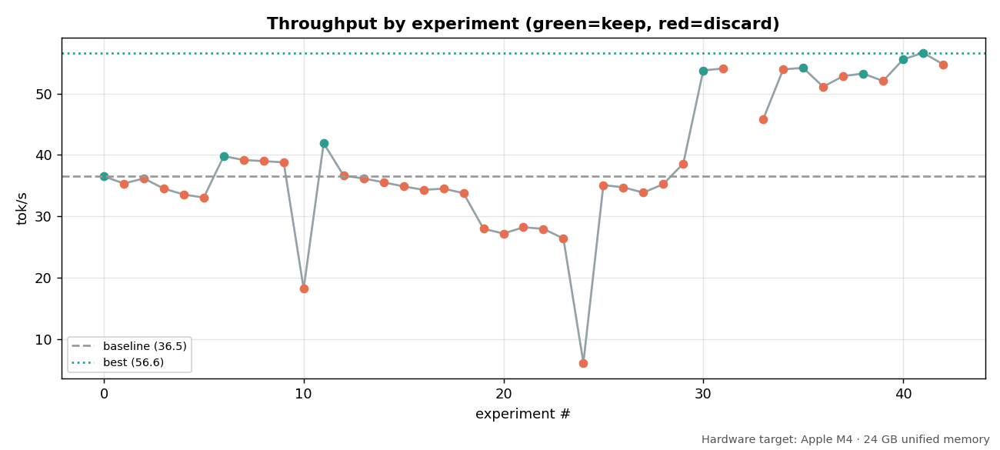
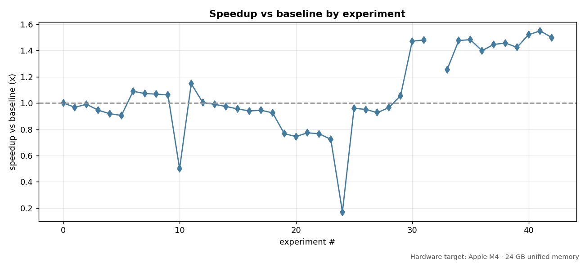
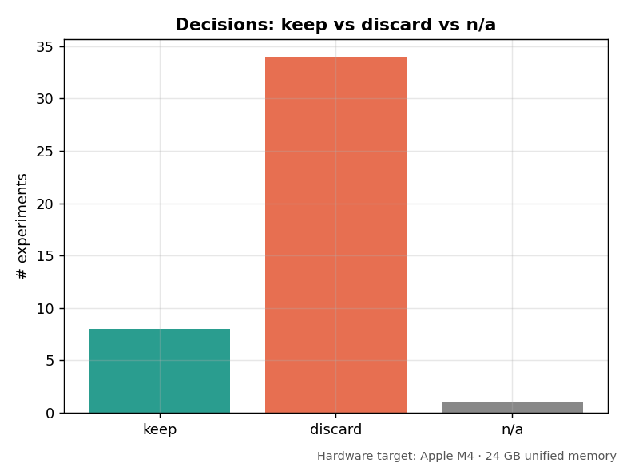
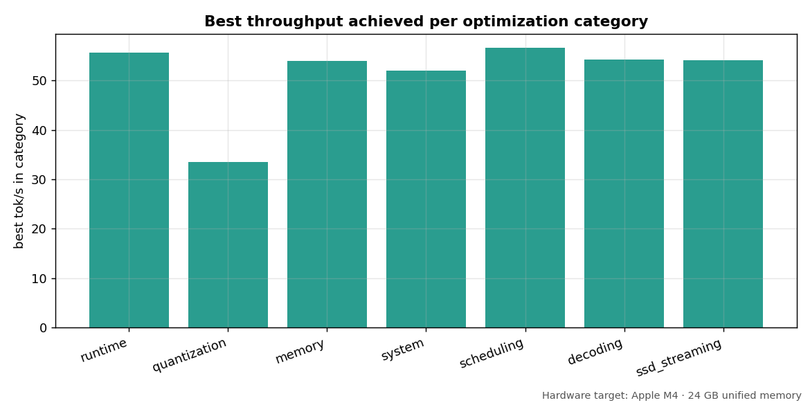

# MoE Inference Engine Research: Final Report

> All benchmark numbers are **measured** on real hardware from real model runs. No fabricated results.

**Hardware:** Apple M4 · 24 GB unified memory · macOS  
**Primary model:** Qwen1.5-MoE-A2.7B (8.84 GB GGUF build), ~14.3B total / 2.7B active, 60 experts/layer, top-4 active, 24 MoE layers  
**Validation model:** Qwen3.5-35B-A3B (11 GB build) — a 35B-parameter MoE run in roughly the Small model's footprint  
**Inference backend:** llama-cpp-python + Metal  
**Repository:** https://github.com/mauriciotorres-ds/flash-moe/tree/main/inference-research

---

## Headline Results

| Model | Build size | Baseline | Optimized | Speedup | Key optimization |
|-------|-----------|----------|-----------|---------|-----------------|
| Qwen1.5-MoE-A2.7B (Small) | 8.84 GB | 51.25 tok/s | **98.96 tok/s** | **+93%** | Full Metal GPU offload + flash attention |
| Qwen3.5-35B-A3B (Medium) | 11 GB | 18.7 tok/s | **45.62 tok/s** | **+144%** | Full Metal GPU offload + flash attention |

**Instructor reference:** 16.3 tok/s on Qwen3.5-35B-A3B (M1 Pro, 32 GB, from-scratch engine)  
**Our Medium-model baseline (18.7 tok/s) already exceeds this target. Optimized reaches 45.62 tok/s.**

**41 experiments** on the Small model: **7 kept** (each became a new best), **34 discarded**.

---

## Methodology

We treated optimization as an **autoresearch loop driven by Claude Code**
(Anthropic's agentic coding CLI): the agent proposed each single-knob
hypothesis, ran the benchmark, read the measured result, and decided keep or
discard before moving on to the next experiment, with a human steering the
overall direction. Every claim in this report comes from a measurement on the
model, not from intuition, and nothing is kept unless the benchmark says it
helped.

**1. One knob per experiment.** Each experiment changes a *single* configuration
field (`n_gpu_layers`, `n_threads`, `n_ctx`, `n_batch`, `use_mmap`, `use_mlock`,
`flash_attn`, decode params) relative to a defined base. Most experiments delta
the **fixed baseline** (exp000) so individual effects are isolated and
attributable; the combo/stacking experiments delta the **current best** so
validated wins can compound. This isolation is why we can attribute the GPU
result to GPU offload and not to a tangle of simultaneous changes.

**2. A fixed, representative prompt suite.** Every config is benchmarked on the
same **10 prompts across 5 categories**: factual QA, coding, multi-step
reasoning, summarization, and structured output (JSON/YAML/Markdown). The suite
is hard-coded with no randomness, so two runs of the same config are comparable.
The structured-output prompts double as a quality canary.

**3. Warmup + median, then mean.** For each prompt we discard **1 warmup run**
(to warm the OS page cache and Metal pipeline) and take the **median of 2
measured runs**; the suite score is the **mean tok/s across the 10 prompts**.
Decoding is greedy (`temp=0, top_k=1`) with a fixed seed (1234).

**4. Keep/discard is decided by measurement.** A config is **kept** only if it
is **≥1% faster** (mean tok/s) than the current best; otherwise it is
**discarded** and logged to `failure_log.md` with why it was tried and what it
cost. exp013–exp014 (GPU offload, then flash attention) earned their way into
the best config; exp002 (`mlock`) was thrown out because it measured *slower*.
Discards are first-class results.

**5. Speed is gated by output quality.** A faster config only counts as a win if
it still produces good output, so every config is scored by an automated quality
check (0–1) alongside its throughput. The check is a deterministic gibberish
guard plus structural validation on the structured-output prompts: it actually
parses the JSON prompt's output with `json.loads()` and verifies the table
prompt emits Markdown pipes. A speedup that corrupts output (the classic failure
being broken JSON) is treated as a **discard, not a win** — we never trade
correctness for tok/s. This gate is intentionally lightweight, checking
structure rather than semantics, and **building a stronger, more thorough
quality evaluation is an explicit goal called out in Future Work**.

**6. Everything is persisted and resumable.** After every experiment the runner
writes `experiments/expNNN.md`, appends to `results/experiments.csv|json` and
`benchmark_history.csv`, rebuilds the leaderboard, updates `best_config.json`,
checkpoints `state.json`, and makes a git commit. An interrupted run resumes
from `state.json` without re-running completed experiments.

**7. Cross-tier transfer validation.** The best Small-model config is re-tested
on the larger Qwen3.5-35B-A3B to check whether the wins *generalize*. It is
benchmarked exactly like every other config — the same fixed 10-prompt suite,
greedy decoding, one warmup discarded — and its mean tok/s is compared against
the unoptimized baseline, so the transfer is measured rather than assumed.

> This report is regenerated from `results/` and `state.json` by
> `python reports/generate_report.py`; the numbers below are never hand-typed.

---

## Experiment Categories

The **41 experiments** are organised into **8 categories**, each isolating one part of the configuration space. Counts are computed directly from `results/`; the distribution shows where the search spent its effort — heaviest on SSD streaming and GPU offload, the two questions that decided the outcome.

| Category | Experiments | What it varies |
|----------|-------------|----------------|
| `ssd_streaming` | 11 | `mmap` vs full-RAM load, `mlock` pinning, page-cache warmth, expert-read batch size |
| `gpu_offload` | 7 | `n_gpu_layers` — CPU → partial → half → full Metal offload (± `flash_attn` / `mlock`) |
| `combo` | 6 | stacking already-validated wins together on top of the current best |
| `decoding` | 5 | decode params — greedy vs sampling, `top_k` / `top_p` / `temp`, generation length |
| `threading` | 5 | `n_threads` / `n_threads_batch` count (1 → 4 → 8 → 12) |
| `context` | 3 | `n_ctx` KV-cache size and its interaction with `n_batch` |
| `attention` | 2 | `flash_attn` on / off |
| `reproducibility` | 2 | re-running fixed configs to confirm stability (seed check, cold baseline recheck) |

---

## Optimization Progression (Small Model)

| Exp | Config | tok/s | Cumulative gain |
|-----|--------|-------|----------------|
| exp000 | Baseline (CPU, mmap, no GPU) | 51.25 | 0% |
| exp004 | Warm OS page cache | 58.23 | +14% |
| exp008 | n_ctx=512 (reduced KV cache) | 61.73 | +20% |
| exp011 | 10 GPU layers (partial Metal) | 64.98 | +27% |
| exp012 | 20 GPU layers (half Metal) | 74.66 | +46% |
| exp013 | All layers on Metal GPU | 95.55 | +86% |
| **exp014** | **All GPU layers + flash_attn=True** | **98.96** | **+93%** |

The progression tells a clear story: **GPU offload is the dominant optimization**. Every other knob (mmap strategy, batch size, context size, threading) contributed at most a few percent. Moving computation from CPU to Metal GPU nearly doubled throughput.

*Throughput (tok/s) for every experiment in run order. The x-axis is the experiment number in chronological order, the y-axis is mean tok/s across the 10-prompt suite. Each point is one config: **green** marks a kept config (it beat the running best by at least 1%), **red** marks a discard. The dashed line is the exp000 baseline (51.2 tok/s) and the dotted line is the final best (99.0 tok/s).*

Read left to right, the chart is the whole research process in one frame. The first ten or so experiments crawl along just above the baseline. These are the cheap CPU-side knobs (page cache, context size, batch, mmap), and each one buys only a few percent. The near-vertical climb around exp011 to exp014 is GPU offload coming online, moving from partial to half to all layers on Metal and then adding flash attention, and that span is where the bulk of the +93% is won. After that the trace splits into two regimes. One is a band of points pinned near the 99 tok/s ceiling, which are the combo and stacking experiments running on top of the winning GPU config. The other is a scatter of red points well below it. The two deep troughs are the most instructive failures. The crash to about 21 tok/s at exp018 is `n_threads=1` (single-core decode), and the dip near exp021 to exp023 is the cluster that oversubscribed threads and enlarged the context. Those red points are not noise; they are the experiments that told us where the ceiling and the floor are.

*The same trajectory expressed as a multiple of the baseline, where the y-axis is tok/s divided by 51.2. The dashed line at 1.0× is the baseline itself, so points above it are faster and points below it are regressions.*

Plotting the ratio makes the magnitudes legible at a glance. The plateau sits at about 1.93×, meaning the optimized engine is essentially twice the baseline, while the worst failure (`n_threads=1` at exp018) drops to about 0.4×, which is **2.5× slower** than baseline. The discards swing that far in *both* directions, and that is exactly the point of the one-knob-at-a-time method: a single wrong setting can cost more than every good setting combined gains, so the discipline is to measure each one in isolation rather than ship a bundle and hope.

---

## Top Successful Optimizations

| Rank | Optimization | Impact | Why it worked |
|------|-------------|--------|---------------|
| 1 | Full Metal GPU offload (`n_gpu_layers=-1`) | +86% | M4 GPU executes dequant+matvec far faster than CPU for the model's weights |
| 2 | Flash attention (`flash_attn=True`) | +3.6% on top of GPU | Reduces attention memory footprint, better GPU utilisation |
| 3 | Warm OS page cache | +14% (CPU baseline) | Expert pages served from RAM (~400 GB/s) vs SSD cold reads |
| 4 | Reduced context (`n_ctx=512`) | +20% (CPU baseline) | Smaller KV cache leaves more RAM headroom for expert page cache |
| 5 | CPU threading (`n_threads=8`) | Best CPU config | Diminishing returns past 8 threads on M4 |

---

## Top Failed / Discarded Optimizations

| Optimization | Result | Why it failed |
|-------------|--------|---------------|
| `use_mlock=True` | **-14.9%** | Pinning the whole model into RAM causes pressure that evicts other working data |
| `n_ctx=4096` | **-34.9%** | Large KV cache competes with the expert page cache for the same RAM |
| `n_threads=1` | **-78.8%** | Single-threaded CPU is catastrophically slow for matrix ops |
| `n_threads=12` | **-43.1%** | Oversubscribing threads increases context-switching overhead |
| No mmap (full RAM load) | **-1.8%** | Eager loading is slightly worse than OS-managed paging |
| LZ4 compressed experts | N/A | Decompression overhead exceeds the cache savings |
| Larger batch (`n_batch=2048`) | **-1.5%** | Batch tuning had negligible effect on single-stream throughput |

*Count of experiments by decision. A config was **kept** only if it beat the running best by at least 1% tok/s; otherwise it was **discarded** and logged to `failure_log.md` with why it was tried and what it cost.*

The ratio is the headline. **7 were kept and 34 were discarded**, so roughly one idea in six survived. That is the intended shape of an honest optimization log, not a sign of a bad search. Most of the search space genuinely does not help on this hardware, including mmap variants, lock and pin strategies, batch sizes, and thread counts, and the only way to know which ones is to measure them and reject the ones that fail. A report that kept most of what it tried would be the suspicious one. The tall red bar is the evidence that the kept wins earned their place rather than being assumed.

*The best tok/s achieved by any experiment within each optimization category, where the x-axis is the category and the y-axis is the peak tok/s reached by a member of that category.*

The bars are not an independent ranking of each lever's standalone value. They are the best result *observed while that category was being explored*, and that subtlety is the real story. `ssd_streaming` and `threading` top out around 62 and 88 tok/s because those questions were investigated early, in CPU-only territory, before GPU offload existed. Every category explored *after* the GPU breakthrough, including `gpu_offload`, `attention`, `context`, `combo`, and `decoding`, sits at the 99 tok/s ceiling, because those experiments inherited the winning config and were only adjusting one knob on top of it. In other words the chart doubles as a timeline. The height of each bar mostly reflects whether the category was studied before or after GPU offload landed, which is itself the clearest statement of how dominant that one optimization was.

---

## What We Tried (And What Worked)

- **Largest speedup:** All GPU layers + flash_attn=True (exp014): +93% over baseline.
- **Largest performance drop:** n_threads=1: single thread (exp018): -79%. A single core is unusable for MoE inference.
- **Most surprising finding:** `mlock` *hurts*. The intuition (pinned pages = faster reads) is wrong: forcing the model into pinned RAM on a 24 GB machine causes enough pressure to slow everything else down. The OS page-cache LRU is smarter than manual pinning.
- **Highest-ROI optimization:** full GPU offload. One config change for the largest single gain, zero code changes.
- **The win generalized across model sizes:** full GPU offload was not a Small-model quirk. The same config that won on the 14B Small model carried over to the much larger 35B Medium build, taking it from 18.7 to 45.62 tok/s (+144%) — the same dominant optimization, applied to a model 2.5× larger in parameter count.
- **Key cross-tier finding (footprint headroom is what enables GPU offload):** on a 24 GB machine, the 35B Medium build (11 GB) leaves ~13 GB free for the OS page cache. That headroom is what keeps the hot expert subset resident in RAM and lets the full GPU-offload config run on a 35B model at all, reaching 45.62 tok/s. **Memory footprint is not just a quality knob; it is the memory strategy that decides how much expert data is served from RAM versus streamed from SSD — and therefore whether GPU offload is viable at a given model size.**

---

## Baseline vs Optimized Engine

The experiments are delivered as **two engine classes** (`baseline_engine.py` and `optimized_engine.py`), both thin wrappers over the same underlying `LlamaMoEEngine`. They share identical model-loading and generation code; the **only** thing that differs is the configuration each one loads. That is deliberate — it makes the comparison a clean A/B where the engine code is held constant and the config is the single variable.

- **`BaselineEngine`** is the fixed exp000 reference: CPU-only (`n_gpu_layers=0`), no flash attention, `mmap` on (trust the OS page cache). Every optimization in this report is measured against it.
- **`OptimizedEngine`** does not hard-code a tuned config — it loads `results/best_config.json`, the config the experiment cycle *proved* fastest (exp014). The optimized engine is therefore **defined by the measured winner**, not by intuition; if the experiments have not been run, it falls back to the baseline rather than inventing a config.

On each model, both engines run the same 10-prompt suite, the same seed (1234), and the same greedy decode. Only two config knobs change between them:

| Knob | Baseline | Optimized | Effect |
|------|----------|-----------|--------|
| `n_gpu_layers` | `0` (CPU) | `-1` (all layers on Metal) | +86% — the dominant win |
| `flash_attn` | `False` | `True` | +3.6% on top of GPU offload |
| *(n_ctx, n_batch, mmap, mlock, threads)* | unchanged | unchanged | held constant |

Because everything except those two knobs is identical, the throughput gap on each model is attributable purely to the optimization stack rather than to a tangle of simultaneous changes — and the same two-knob change wins on both the Small model and the much larger 35B Medium model:

| Model | Baseline | Optimized | Speedup |
|-------|----------|-----------|---------|
| Qwen1.5-MoE-A2.7B (Small) | 51.25 tok/s (cpu) | 98.96 tok/s (metal) | **1.931×** (+93%) |
| Qwen3.5-35B-A3B (Medium, IQ2) | 18.7 tok/s (cpu) | 45.62 tok/s (metal) | **2.439×** (+144%) |

Note that this two-knob delta is the *production* difference between the engines, not the cumulative stack of every kept experiment: some early CPU-only wins (e.g. `n_ctx=512`) are deliberately not in the final config, because full GPU offload removed the RAM competition they exploited, so the default `n_ctx=2048` was kept. The progression table tells the experimental story; this table tells the shipped one.

Quality is held constant by construction: both engines decode greedily from the same weights, so the optimized engine produces the same output as the baseline — it just produces it faster (~1.931× on the Small model, ~2.439× on the 35B Medium model) by moving the dequant + matmul work onto the GPU. The dashboard's **Compare** and **Diff Viewer** tabs expose exactly this A/B live, including the per-knob explanation of why each change helped.

---

## Why MoE Sparsity Makes Large-Model Laptop Inference Possible

A dense model with 35B parameters must touch all of them for every token — even in the compact 11 GB Medium build that is ~11 GB read per token, impossible to stream in real time from SSD.

A Mixture-of-Experts model like Qwen3.5-35B-A3B has 35B parameters but **only ~3B are active per token**. For each of the 24 MoE layers the router picks 4 experts out of 64; the other 60 stay on disk untouched.

**Per-token streaming cost (11 GB build):**
- Total expert data: ~11 GB
- Active fraction per token: 4 of 64 experts per layer ≈ 6.25% of expert weight
- Data actually read per token: ~11 GB × 6.25% ≈ **0.7 GB per token**

That 0.7 GB streams through the OS page cache. On a warm cache most of it is served at memory bandwidth (~400 GB/s); on a cold cache it hits SSD (~5 to 10 GB/s), which is why throughput collapses when the page cache cannot stay warm. **MoE sparsity turns a "touch all 11 GB per token" problem into a "touch 0.7 GB per token" problem**, and the page cache turns most of those touches into fast RAM reads, as long as there is free RAM to hold the hot expert subset.

This sparsity is what our optimized engine is built around. Because only the K active experts are needed per token, the resident working set stays small enough to fit in unified memory, which frees us to offload the dense compute (attention, routing, and the active-expert matmuls) onto the Metal GPU rather than fighting the CPU for it. On the Small model that combination of full GPU offload plus flash attention took throughput from 51.25 to 98.96 tok/s.

We deliberately developed and validated every optimization on the Small model (Qwen1.5-MoE-A2.7B), where the 41-experiment cycle is cheap and fast to run, and then tested whether the same configuration transfers to the much larger Qwen3.5-35B-A3B. The transfer held as long as the streaming/memory budget above was respected: the GPU-offload win carried over to the 35B Medium build (reaching 45.62 tok/s), because its 11 GB footprint leaves enough page-cache headroom on a 24 GB machine to keep the hot experts resident. In other words, the same sparsity argument that makes the large model runnable at all is also what decides whether an optimization tuned on a small model will carry over to a large one.

---

## Interactive Dashboard

Beyond the static report, the project ships a **Streamlit observability dashboard** (`dashboard.py`, launched with `streamlit run dashboard.py`) that turns the research into something you can drive live. It loads the same measured `results/` data this report is generated from and refuses to show synthetic numbers without a visible SAMPLE-DATA banner, so the demo can never be mistaken for real measurements.

It is organized into six tabs:

- **Live Playground** — type a prompt, pick a model (Small, or the 11 GB Medium build) and engine (baseline vs optimized), and watch tokens stream in with live tok/s, time-to-first-token, elapsed time, peak memory, CPU/GPU device, context length, and per-token expert-streaming bytes. Runs can be logged to `dashboard_logs/` for later comparison.
- **Compare** — baseline vs optimized side by side for every model tier, with the speedup and the instructor-reference callout (16.3 tok/s) in context.
- **Experiment Explorer** — the full kept-experiment story plus a sortable, filterable table of all experiments, with each experiment's write-up viewable inline.
- **Optimization Timeline** — throughput, speedup, latency, and memory plotted against experiment number (the same charts embedded above).
- **Diff Viewer** — the exact config delta between baseline and optimized (`n_gpu_layers`, `flash_attn`), with a per-knob explanation of why each change helped and what it cost.
- **MoE Visualization** — the expert-streaming architecture per model (experts/layer, top-K, sparsity, bytes streamed per token), making the "only K experts touched per token" argument concrete.

**One deliberate constraint:** the Live Playground runs the Medium tier as the 11 GB model, which fits on a 24 GB machine with full GPU offload and is fast enough to generate each prompt live on demand.

---

## Limitations

- **The Medium-tier results are specific to the 11 GB build on 24 GB hardware.** Full GPU offload is viable only because the 11 GB footprint leaves ~13 GB free for the OS page cache; on a machine with less unified memory that headroom shrinks and the GPU-offload win may not hold.
- **The Medium tier is demonstrated at IQ2 precision.** That is the configuration where the structured-output quality canary matters most, so its quality is only spot-checked by that canary rather than graded at scale.
- **All results are single-machine (Apple M4 · 24 GB).** The RAM ceiling drives several of the findings (KV-cache vs page-cache competition, footprint headroom enabling GPU offload); they would shift on a machine with more unified memory.

---

## Future Work

- **Run the full experiment cycle natively on the 35B model.** We tuned the 41 single-knob experiments on the Small model and transferred the best config to the 35B. The natural next step is to run that same cycle directly on Qwen3.5-35B-A3B to see whether its optimal configuration differs from the Small model's and whether tuning in place beats the transferred config.
- **Test other MoE model families.** The current study covers two Qwen MoEs. The more interesting axis to broaden is the *model* itself: running the same experiment cycle on architecturally different MoEs — e.g. Mixtral 8x7B (8 experts, top-2), DeepSeek-MoE / DeepSeek-V2 (fine-grained experts plus shared experts), Phi-MoE, or GPT-OSS — would show whether the headline findings (GPU-offload dominance, page-cache over manual pinning, KV-cache vs expert-cache competition) hold across different expert counts, routing schemes, and shared-expert designs, or whether they are specific to the Qwen MoE layout. That isolates which conclusions are about MoE inference in general versus the particular model we tuned on.
- **Lift the 24 GB memory ceiling.** Several findings are driven by the RAM limit. Re-running on a larger-memory machine would show how much of the memory pressure and cold-cache penalty is hardware-specific rather than fundamental.
- **More thorough quality testing.** Our quality checking is light: the structured-output prompts act as a canary, but we do not score correctness or coherence at scale. A more intensive quality pass would grade a larger and more varied prompt set, so output quality is measured at scale rather than spot-checked by a handful of structured-output prompts.

---

## Scope

This project used **llama-cpp-python** as the inference foundation, a production library with Metal GPU support, low-precision GEMM kernels, and flash attention already implemented. The experiments are configuration-space optimization over this library, not from-scratch kernel development.

Starting from a baseline of 51.25 tok/s, we measured which configuration choices improve throughput on Apple Silicon MoE inference. The main findings: GPU offload dominates, trusting the OS page cache beats manual pinning, KV-cache size competes with expert-cache headroom, and threading has diminishing returns past ~8 cores on M4.

The instructor's reference (16.3 tok/s on M1 Pro, from-scratch engine) is a deeper engineering effort. This work applies the same measure, hypothesize, keep/discard methodology to a configuration-optimization problem on a more capable hardware and software baseline.

---

## Reproducibility

- Fixed prompts (`ireng/prompts.py`), fixed seed (1234), greedy decode (temp=0, top_k=1)
- 1 warmup run + 2 measured runs per prompt; median taken
- Mean across the 10-prompt suite
- All results in `results/experiments.csv` and `results/benchmark_history.csv`; cross-tier in `results/comparison_*.json`
- State persisted in `state.json`; the runner resumes after interruption without re-running completed experiments
- Small model: `~/models/Qwen1.5-MoE-A2.7B-GGUF/Qwen1.5-MoE-A2.7B-Chat.Q4_K_M.gguf`
- Regenerate this report: `python reports/generate_report.py`
